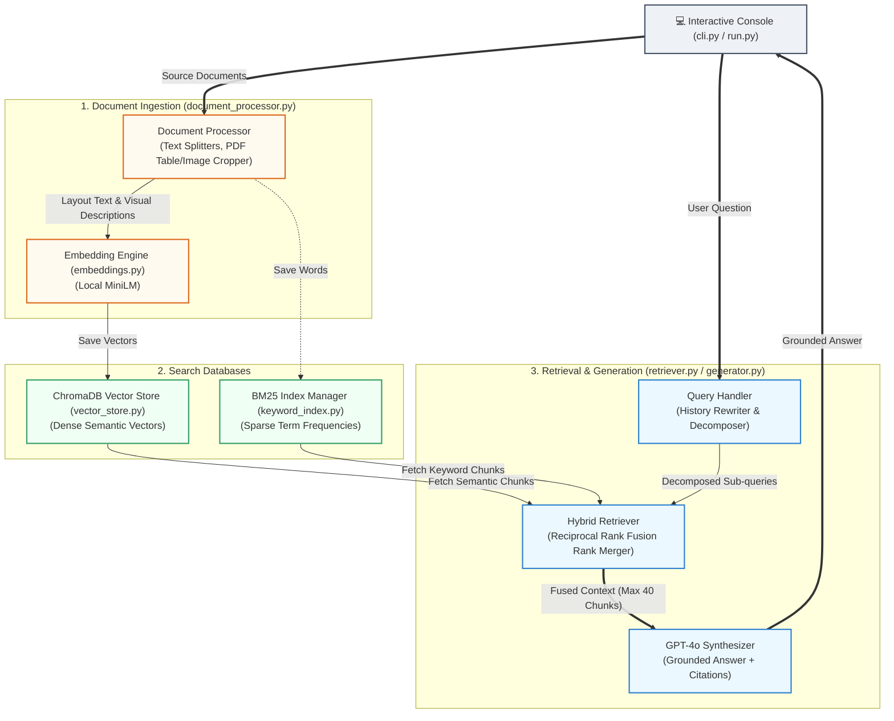

# Systems Architecture & Data Flow

This document details the end-to-end system architecture of the **RAG It** search engine. It describes the precise pipelines, module scopes, and how documents and queries move through the system.

---

## 🏗️ Graphical Architecture Diagram

The system operates as a dual-phase pipeline. The **Ingestion Pipeline** runs offline to process and index documents, while the **Retrieval & Generation Pipeline** runs online to answer user queries dynamically.



---

## 📂 Detailed Subsystem Pipelines

### 1. Ingestion & Indexing Pipeline (Offline Phase)
The Ingestion Pipeline parses documents, processes visual assets, and indexes representations into the search databases.

1. **Routing:** The `DocumentProcessor` receives a path, identifies the file type by its suffix, and delegates parsing:
   * **PDF:** PyMuPDF iterates page-by-page. Headings are dynamically identified based on size thresholds relative to the document-wide average font size.
   * **Excel / CSV:** The spreadsheet is read into a Pandas DataFrame. Large sheets are automatically sliced every **50 rows** to prevent model token limits from being exceeded. The column headers are duplicated on each chunk.
   * **Word / Markdown / Text:** Paragraph blocks and header styles are read sequentially.
2. **Visual Parsing (PDFs only):** PyMuPDF detects coordinates for tables and figures. The pipeline crops these areas as standalone PNG images:
   * Table crops are sent to OpenAI's VLM along with a draft text markdown table. The VLM reconstructs and outputs a visually cleaned Markdown table along with a 2-3 sentence trend summary.
   * Diagram/figure crops are sent to OpenAI's VLM to generate detailed descriptions, flow logic, and OCR text logs.
3. **Representation Generation:** Chunks are converted into vector representations. The system uses a local `sentence-transformers/all-MiniLM-L6-v2` transformer encoder on GPU/CPU to compute 384-dimensional dense vectors.
4. **Database Storage:**
   * **ChromaDB:** Stores the vectors and flat metadata mappings (such as document name, page number, section title, and image cache paths) inside a size-isolated collection (`multimodal_rag_collection_384`).
   * **BM25 Index:** Tokenizes and lowercases text chunks, building a word frequency lookup table serialized locally into `bm25_index.pkl` under `data/cache/keyword/`.

---

### 2. Retrieval & Rank Fusion Pipeline (Online Phase)
The Retrieval Pipeline processes queries to retrieve context:

```text
               ┌───────────────────────────┐
               │    User Query (CLI Input) │
               └─────────────┬─────────────┘
                             │
                             ▼
               ┌───────────────────────────┐
               │ Conversational Rewriter   │
               └─────────────┬─────────────┘
                             │ (Standalone Query)
                             ▼
               ┌───────────────────────────┐
               │    Query Decomposer       │
               └─────────────┬─────────────┘
                             │ (Sub-queries 1, 2, ...)
                             ▼
               ┌───────────────────────────┐
               │       Hybrid Search       │
               │  (ChromaDB + BM25 Search) │
               └─────────────┬─────────────┘
                             │ (Semantic & Keyword Matches)
                             ▼
               ┌───────────────────────────┐
               │  Reciprocal Rank Fusion   │
               └─────────────┬─────────────┘
                             │ (Fused matches)
                             ▼
               ┌───────────────────────────┐
               │  Table Page Enhancement   │
               └─────────────┬─────────────┘
                             │
                             ▼
               ┌───────────────────────────┐
               │ Global Catalog Expansion  │
               └─────────────┬─────────────┘
                             │
                             ▼
               ┌───────────────────────────┐
               │ Fused Context (Max 40)    │
               └───────────────────────────┘
```

1. **Conversational Rewriting:** GPT-4o analyzes the active session's conversation history (last 5 turns) and rewrites follow-up questions to resolve pronouns (e.g. *"what about table 4?"* becomes *"table 4 in biosensors.pdf"*).
2. **Query Decomposition:** GPT-4o splits complex or comparative queries into 1 to 3 distinct sub-queries (e.g., *"compare Table 2 and Table 3"* yields `["Table 2", "Table 3"]`).
3. **Intent Classification:** The system determines if the query asks for a complete list or summary of *all* figures or *all* tables in the scope.
4. **Dual Search:** For each sub-query, the retriever queries ChromaDB using vector cosine similarity and searches the BM25 index using word frequency matches.
5. **Reciprocal Rank Fusion (RRF):** Merges vector and keyword candidate results. RRF calculates scores using a ranking constant ($k = 60$):
   $$\text{RRF Score} = \sum_{m \in \text{Matches}} \frac{1}{60 + \text{Rank}_m}$$
6. **Context Enhancements:**
   * **Table-page expansion:** Automatically retrieves adjacent text chunks on pages that contain tables.
   * **Global catalog boosting:** Appends all document figures or tables if a catalog query intent is classified.
   * Interleaves sub-query results and caps the context at 40 chunks.

---

### 3. LLM Synthesis & Presentation Pipeline (Online Phase)
The Synthesis Pipeline generates and displays answers:

1. **System Grounding Prompt:** Combines the retrieved context blocks, the standalone query, and strict grounding instructions:
   * Facts must be supported *only* by retrieved chunks.
   * Inline source citations must be formatted precisely as `[Doc/Table/Figure: filename, Page: X]`.
   * Requests for simulations/code must state if such code exists in the document, displaying a disclaimer before outputting a hypothetical script.
2. **LLM Generation:** Calls GPT-4o with a low temperature ($0.1$) to ensure factual grounding.
3. **Consuming Token Tracker:** Records prompt and completion tokens used during the query, accumulating session metrics.
4. **ANSI Table & Format Parsing:**
   * Markdown tables are converted into box-bordered ASCII grids.
   * Inline citation text is colored yellow.
   * Headers and bold texts are formatted with cyan and green ANSI escapes.
5. **Visual Launcher Hook:** The CLI extracts media filenames from inline citations. If auto-open is enabled, the system prompts the user and launches the cited PNG crop in the default OS photo viewer using `os.startfile()`.
